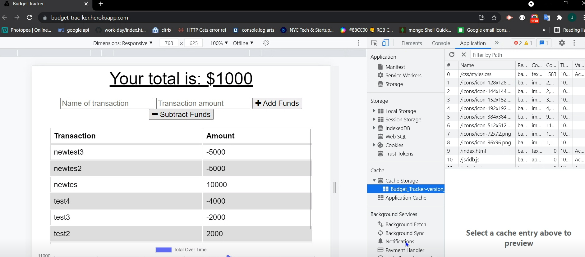

   
  
  

  
  
  <h1> Budget_Tracker   
   
</h1>

    
    
    
    
    
    
    

   
   
   
  
  <a href="#about"><strong>Explore the screenshots »</strong></a>
   
   
  
  

  
  
  
  

   
  
   
    
  
    
  

  
   
  
  

  
Table of Contents

  
  - [About](#about)
  - [Built With](#built-with)
  - [Installation](#installation)
  - [Authors & contributors](#authors--contributors)
  - [Acknowledgements](#Acknowledgements)
  - [License](#License) 
  
  
  
  
   
  
  
  
  ## About     
  ---

   

 
 HI this is an app that will help you track and manage you monthy budgey , that way you can stick to your budget and get to goal with accuracy , it also works Offline just in case you are on a dead zone , and as you get a connection back it will automatically reflect all the changes you made during the offline period.
    

   
   

  

  
Usage Screenshots and Demo

    
  
   
   
   
  
   
   
  
    
   
 
   
   

   
   

    

  
   

please to watch the A walkthrough video demonstrating the functionality of the application click the above play Icon.

  

  
   
   
  
  
  ## Built With
  ---

   

> - 
> - 
> - 
> - 
> - 
> - 
> - 
> - 

   
   
  
  ##  Installation
  ---

   
  
   1. Clone this https://github.com/mejialaguna/Budget_Tracker.git .
   2. Install node js <a href="https://nodejs.org/en/"> [ HERE ]</a>. 
   3. inside your terminal.   
   4. Install all Dependency using ----> npm i.  
   5. Start your server using node server inside your terminal. 
   6. Or simply jus go directly to the web site just by clicking <a href="https://budget-trac-ker.herokuapp.com">here.</a>
   7. Enjoy

   
   
  
  
  ##  Authors & contributors
  ---

   
   
  Jose Luis Mejia Laguna.
  
   
   
  

  ##  Acknowledgements
  ---

   

  First off , thanks for taking the time to check out my app! , contribution are what make this open-source community such an amazing place to learn , inspire and create. Any contribution you make will benefit everyone interested in using the app and are very appriciated.

   
   
  
  ## License
  ---
   

  
  
  
  

# Acceptance Criteria
GIVEN a budget tracker without an internet connection
WHEN the user inputs an expense or deposit
THEN they will receive a notification that they have added an expense or deposit
 
WHEN the user reestablishes an internet connection
THEN the deposits or expenses added while they were offline are added to their transaction history and their totals are updated
